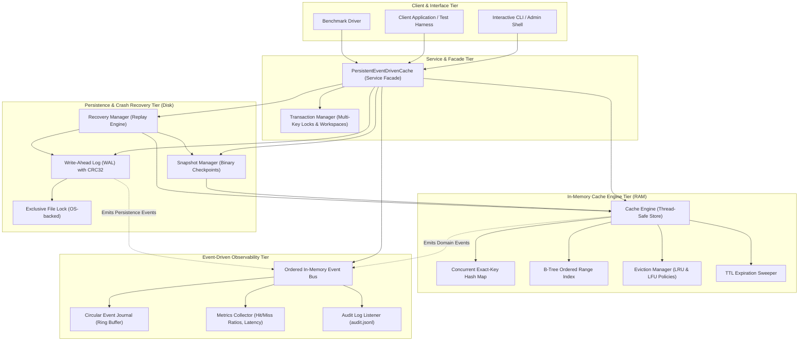

# System Architecture Diagram

```mermaid
flowchart TD
    subgraph Client_Layer ["Client & Interface Tier"]
        CLI["Interactive CLI / Admin Shell"]
        APP["Client Application / Test Harness"]
        BENCH["Benchmark Driver"]
    end

    subgraph Service_Tier ["Service & Facade Tier"]
        FACADE["PersistentEventDrivenCache (Service Facade)"]
        TX_MGR["Transaction Manager (Multi-Key Locks & Workspaces)"]
    end

    subgraph Core_Engine ["In-Memory Cache Engine Tier (RAM)"]
        ENGINE["Cache Engine (Thread-Safe Store)"]
        MAP["Concurrent Exact-Key Hash Map"]
        BTREE["B-Tree Ordered Range Index"]
        EVICT["Eviction Manager (LRU & LFU Policies)"]
        TTL_SWEEP["TTL Expiration Sweeper"]
    end

    subgraph Persistence_Tier ["Persistence & Crash Recovery Tier (Disk)"]
        WAL["Write-Ahead Log (WAL) with CRC32"]
        SNAP["Snapshot Manager (Binary Checkpoints)"]
        RECOVERY["Recovery Manager (Replay Engine)"]
        LOCK["Exclusive File Lock (OS-backed)"]
    end

    subgraph Observability_Tier ["Event-Driven Observability Tier"]
        BUS["Ordered In-Memory Event Bus"]
        JOURNAL["Circular Event Journal (Ring Buffer)"]
        METRICS["Metrics Collector (Hit/Miss Ratios, Latency)"]
        AUDIT["Audit Log Listener (audit.jsonl)"]
    end

    %% Client Interactions
    CLI --> FACADE
    APP --> FACADE
    BENCH --> FACADE

    %% Facade Coordination
    FACADE --> TX_MGR
    FACADE --> ENGINE
    FACADE --> WAL
    FACADE --> BUS
    FACADE --> SNAP
    FACADE --> RECOVERY

    %% Engine Structure
    ENGINE --> MAP
    ENGINE --> BTREE
    ENGINE --> EVICT
    ENGINE --> TTL_SWEEP

    %% Persistence Flow
    WAL --> LOCK
    SNAP --> ENGINE
    RECOVERY --> SNAP
    RECOVERY --> WAL
    RECOVERY --> ENGINE

    %% Event Flow
    BUS --> JOURNAL
    BUS --> METRICS
    BUS --> AUDIT
    ENGINE -.->|Emits Domain Events| BUS
    WAL -.->|Emits Persistence Events| BUS
```
