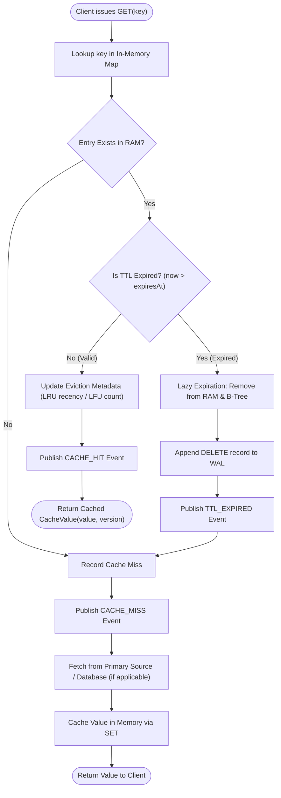
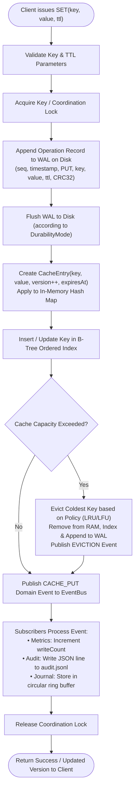

# Cache Read & Write Operation Flows

---

## 1. Cache Read Flow (`GET` Operation with Cache-Aside / Lookup)

```mermaid
flowchart TD
    START(["Client issues GET(key)"]) --> LOOKUP["Lookup key in In-Memory Map"]
    
    LOOKUP --> FOUND{"Entry Exists in RAM?"}
    
    FOUND -- No --> MISS["Record Cache Miss"]
    MISS --> PUB_MISS["Publish CACHE_MISS Event"]
    PUB_MISS --> FETCH_SRC["Fetch from Primary Source / Database (if applicable)"]
    FETCH_SRC --> WRITE_CACHE["Cache Value in Memory via SET"]
    WRITE_CACHE --> RET_VAL(["Return Value to Client"])
    
    FOUND -- Yes --> CHK_TTL{"Is TTL Expired? (now > expiresAt)"}
    
    CHK_TTL -- Yes (Expired) --> LAZY_DEL["Lazy Expiration: Remove from RAM & B-Tree"]
    LAZY_DEL --> LOG_DEL["Append DELETE record to WAL"]
    LOG_DEL --> PUB_EXP["Publish TTL_EXPIRED Event"]
    PUB_EXP --> MISS
    
    CHK_TTL -- No (Valid) --> UPDATE_EVICT["Update Eviction Metadata (LRU recency / LFU count)"]
    UPDATE_EVICT --> PUB_HIT["Publish CACHE_HIT Event"]
    PUB_HIT --> RET_HIT(["Return Cached CacheValue(value, version)"])
```

---

## 2. Cache Write Flow (`SET` Operation with Write-Ahead Logging)

```mermaid
flowchart TD
    W_START(["Client issues SET(key, value, ttl)"]) --> W_VAL["Validate Key & TTL Parameters"]
    
    W_VAL --> W_LOCK["Acquire Key / Coordination Lock"]
    
    W_LOCK --> W_WAL["Append Operation Record to WAL on Disk<br/>(seq, timestamp, PUT, key, value, ttl, CRC32)"]
    
    W_WAL --> W_FLUSH["Flush WAL to Disk (according to DurabilityMode)"]
    
    W_FLUSH --> W_MEM["Create CacheEntry(key, value, version++, expiresAt)<br/>Apply to In-Memory Hash Map"]
    
    W_MEM --> W_INDEX["Insert / Update Key in B-Tree Ordered Index"]
    
    W_INDEX --> W_CAP{"Cache Capacity Exceeded?"}
    
    W_CAP -- Yes --> W_EVICT["Evict Coldest Key based on Policy (LRU/LFU)<br/>Remove from RAM, Index & Append to WAL<br/>Publish EVICTION Event"]
    W_CAP -- No --> W_EVENT
    
    W_EVICT --> W_EVENT["Publish CACHE_PUT Domain Event to EventBus"]
    
    W_EVENT --> W_SUBS["Subscribers Process Event:
    • Metrics: Increment writeCount
    • Audit: Write JSON line to audit.jsonl
    • Journal: Store in circular ring buffer"]
    
    W_SUBS --> W_UNLOCK["Release Coordination Lock"]
    
    W_UNLOCK --> W_RET(["Return Success / Updated Version to Client"])
```
