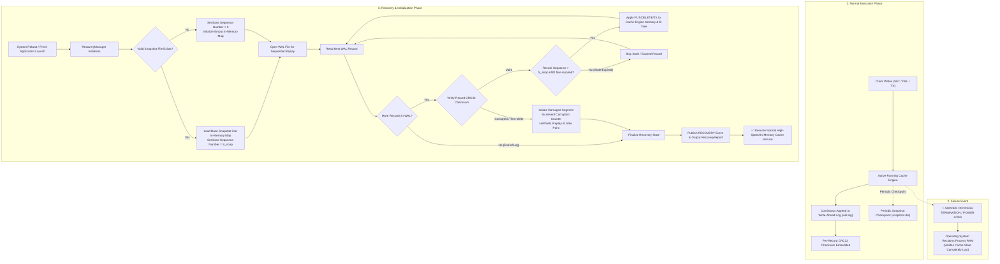

# Crash & Recovery Sequence Flow

```mermaid
flowchart TD
    subgraph Normal_Operation ["1. Normal Execution Phase"]
        RUN["Active Running Cache Engine"]
        WRITES["Client Writes (SET / DEL / TX)"]
        WAL_WRITE["Continuous Append to Write-Ahead Log (wal.log)"]
        CRC_GEN["Per-Record CRC32 Checksum Embedded"]
        SNAP_SAVE["Periodic Snapshot Checkpoint (snapshot.dat)"]

        WRITES --> RUN
        RUN --> WAL_WRITE
        WAL_WRITE --> CRC_GEN
        RUN -.->|Periodic Checkpoint| SNAP_SAVE
    end

    subgraph Failure_Event ["2. Failure Event"]
        CRASH["💥 SUDDEN PROCESS TERMINATION / POWER LOSS"]
        WIPED["Operating System Reclaims Process RAM<br/>(Volatile Cache State Completely Lost)"]

        RUN -.-> CRASH
        CRASH --> WIPED
    end

    subgraph Startup_Phase ["3. Recovery & Initialization Phase"]
        RESTART["System Reboot / Fresh Application Launch"]
        RECOV_INIT["RecoveryManager Initializes"]
        CHK_SNAP{"Valid Snapshot File Exists?"}

        RESTART --> RECOV_INIT
        RECOV_INIT --> CHK_SNAP

        CHK_SNAP -- Yes --> LOAD_SNAP["Load Base Snapshot into In-Memory Map<br/>Set Base Sequence Number = S_snap"]
        CHK_SNAP -- No --> ZERO_BASE["Set Base Sequence Number = 0<br/>Initialize Empty In-Memory Map"]

        LOAD_SNAP --> SCAN_WAL["Open WAL File for Sequential Replay"]
        ZERO_BASE --> SCAN_WAL

        SCAN_WAL --> READ_REC["Read Next WAL Record"]
        READ_REC --> REC_EXISTS{"More Records in WAL?"}

        REC_EXISTS -- Yes --> CRC_CHECK{"Verify Record CRC32 Checksum"}
        
        CRC_CHECK -- Valid --> VER_CHECK{"Record Sequence > S_snap AND Non-Expired?"}
        
        VER_CHECK -- Yes --> APPLY_MEM["Apply PUT/DELETE/TX to Cache Engine Memory & B-Tree"]
        VER_CHECK -- No (Stale/Expired) --> SKIP_REC["Skip Stale / Expired Record"]
        
        APPLY_MEM --> READ_REC
        SKIP_REC --> READ_REC

        CRC_CHECK -- Corrupted / Torn Write --> REPORT_CORRUPT["Isolate Damaged Segment<br/>Increment Corruption Counter<br/>Halt WAL Replay at Safe Point"]

        REC_EXISTS -- No (End of Log) --> FINALIZE_RECOV["Finalize Recovery State"]
        REPORT_CORRUPT --> FINALIZE_RECOV

        FINALIZE_RECOV --> PUB_RECOV["Publish RECOVERY Event & Output RecoveryReport"]
        PUB_RECOV --> RESUME["✅ Resume Normal High-Speed In-Memory Cache Service"]
    end
```
